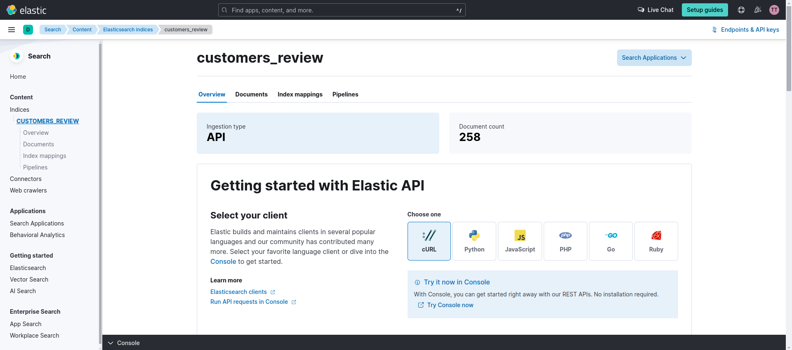

# realtime-skek

A real-time data processing pipeline leveraging Apache Spark, Apache Kafka, Elasticsearch, and Kibana (SKEK) to ingest, process, and visualize streaming data efficiently.


---

## 📖 Table of Contents

- [About](#about)
- [Architecture](#architecture)
- [Features](#features)
- [Prerequisites](#prerequisites)
- [Installation](#installation)
- [Usage](#usage)
- [Project Structure](#project-structure)
- [Technologies Used](#technologies-used)
- [Screenshots](#screenshots)
- [Contributing](#contributing)
- [License](#license)
- [Contact](#contact)

---

## 📌 About

This project demonstrates a real-time data processing pipeline that:

1. **Ingests** streaming data using Apache Kafka.
2. **Processes** the data in real-time with Apache Spark.
3. **Stores** the processed data in Elasticsearch.
4. **Visualizes** the data using Kibana dashboards.

---

## 🏗️ Architecture

The pipeline follows this flow:

1. **Data Ingestion**:
   - Apache Kafka acts as the message broker, receiving streaming data from various sources.

2. **Data Processing**:
   - Apache Spark consumes data from Kafka topics, processes it in real-time, and prepares it for storage.

3. **Data Storage**:
   - Processed data is stored in Elasticsearch for efficient querying and analysis.

4. **Data Visualization**:
   - Kibana connects to Elasticsearch to provide real-time dashboards and visualizations.

---

## ✨ Features

- Real-time data ingestion and processing.
- Scalable and efficient data pipeline using open-source tools.
- Dockerized setup for easy deployment.
- Predefined Kibana dashboards for data visualization.

---

## ✅ Prerequisites

Before you begin, ensure you have met the following requirements:

- Docker and Docker Compose installed on your machine.
- Basic understanding of Kafka, Spark, Elasticsearch, and Kibana.

---

## 🚀 Installation

1. **Clone the repository**:

   ```bash
   git clone https://github.com/TawfikYasser/realtime-skek.git
   cd realtime-skek
   ```

2. **Start the Docker containers**:

   ```bash
   docker-compose up --build
   ```

   This will set up Kafka, Spark, Elasticsearch, and Kibana containers.

---

## 🛠️ Usage

1. **Kafka**:
   - Access Kafka at `localhost:9092`.
   - Use Kafka CLI or tools to produce and consume messages.

2. **Spark**:
   - Spark jobs are configured to consume data from Kafka and process it.
   - Check the `jobs/` directory for Spark job scripts.

3. **Elasticsearch**:
   - Access Elasticsearch at `http://localhost:9200`.
   - Use tools like Kibana or Postman to interact with the Elasticsearch API.

4. **Kibana**:
   - Access Kibana at `http://localhost:5601`.
   - Use the predefined dashboards or create new visualizations based on the ingested data.

---

## 📁 Project Structure

```bash
realtime-skek/
├── config/                 # Configuration files
├── jobs/                   # Spark job scripts
├── schemas/                # Data schemas
├── Dockerfile.spark        # Dockerfile for Spark
├── README.md               # Project documentation
├── docker-compose.yml      # Docker Compose configuration
├── elastic-done.png        # Screenshot of Elasticsearch setup
├── elastic-queries.txt     # Sample Elasticsearch queries
├── kafka-cluster-topic.png # Screenshot of Kafka topics
├── kafka-elastic-connector.png # Screenshot of Kafka to Elasticsearch connector
├── kibana-dashboard.png    # Screenshot of Kibana dashboard
└── requirements.txt        # Python dependencies
```

---

## 🧰 Technologies Used

- **Apache Kafka**: Distributed event streaming platform.
- **Apache Spark**: Unified analytics engine for large-scale data processing.
- **Elasticsearch**: Distributed, RESTful search and analytics engine.
- **Kibana**: Data visualization dashboard for Elasticsearch.
- **Docker & Docker Compose**: Containerization and orchestration tools.
- **Python**: Programming language for scripting and job development.

---

## 📸 Screenshots

**Kafka Cluster Topics**:


**Kafka to Elasticsearch Connector**:


**Elasticsearch Setup**:



**Kibana Dashboard**:


---

## 🤝 Contributing

Contributions are welcome! To contribute:

1. **Fork** the repository.
2. **Create** a new branch: `git checkout -b feature/your-feature-name`.
3. **Commit** your changes: `git commit -m 'Add some feature'`.
4. **Push** to the branch: `git push origin feature/your-feature-name`.
5. **Submit** a pull request.

Please ensure your code adheres to the project's coding standards and includes relevant tests.

---

## 📄 License

This project is licensed under the [MIT License](LICENSE).

---

## 📬 Contact

**Tawfik Yasser**  
GitHub: [@TawfikYasser](https://github.com/TawfikYasser)

---
